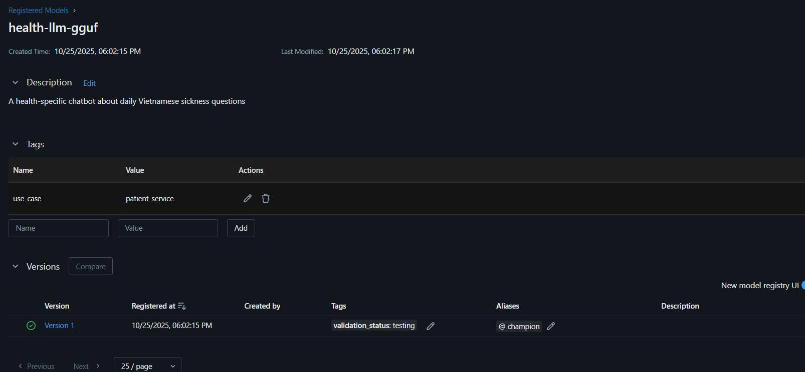

# Vietnamese Legal QA Chatbot

## Introduction

Our project focuses on implementing a Vietnamese Legal Question-Answering chatbot using fine-tuned LLM models in GGUF format. The system leverages MLOps practices with FastAPI backend, Gradio frontend, and comprehensive CI/CD pipeline using Jenkins and Kubernetes. This chatbot aims to provide accurate legal consultation in Vietnamese, making legal information more accessible to users through an intuitive web interface.

## Table of Contents

1. **Vietnamese Legal QA Chatbot**
   - Introduction
   - Project Structure
2. **Setup Amazon S3 & MLflow**
   - Configure AWS S3 Bucket
   - Setup MLflow Tracking Server
3. **Finetune Tiny Model**
   - Model Finetuning Process
   - Convert to GGUF Format
4. **Local**
   - Demo
   - Running in Docker
   - Monitoring
   - CI/CD
5. **Production**
   - Deploying to Kubernetes

## Project Structure

```
monitor_2_deployment/
├── demo.ipynb                     - Jupyter notebook for running the demo
├── docker-compose.yml             - Docker Compose configuration file
├── Dockerfile                     - Dockerfile for building the image
├── src/                           - Directory for application source code
│   ├── main.py                    - FastAPI backend server
│   ├── frontend.py                - Gradio web interface
│   └── chat_service.py            - LLM service logic
├── jenkins/                       - Directory for Jenkins configuration
│   ├── README.md                  - Jenkins setup guide
│   ├── Dockerfile                 - Custom Jenkins image
│   └── *.yaml                     - Kubernetes manifests
├── helm/                          - Directory for Helm chart deployment
│   ├── Chart.yaml
│   ├── values.yaml
│   └── templates/
├── mlflow/                        - Directory for MLflow tracking server
├── monitor/                       - Directory for monitoring (Prometheus, Grafana)
├── notebook/                      - Directory for model training notebooks
├── scripts/                       - Directory for utility scripts
├── Jenkinsfile                    - Jenkins pipeline script for CI/CD process
├── README.md                      - This README file
└── requirements.txt               - Python requirements file
```

# Setup Amazon S3 & MLflow

## Configure AWS S3 Bucket

Before working with the model training and conversion pipeline, set up AWS S3 for artifact storage:

```bash
# Create .env file with AWS credentials
cp .env.example .env
```

Add the following variables to your `.env` file:

```env
AWS_ACCESS_KEY_ID=your_aws_access_key
AWS_SECRET_ACCESS_KEY=your_aws_secret_key
AWS_DEFAULT_REGION=ap-southeast-2
AWS_BUCKET_NAME=mlflow-artifacts-monitor
MLFLOW_TRACKING_URI=https://your-ngrok-url.ngrok-free.dev
```

**S3 Bucket Setup:**
1. Create an S3 bucket for MLflow artifacts storage
2. Configure IAM user with S3 access permissions
3. Generate access keys for programmatic access

**Mlflow setup**
1. Run the command in ubuntu terminal: make mlflow_server
2. Get the mlflow expose url through ngrok: mlflow mlfow_url
3. [Optional] - expose mlflow by cloudfare: make cloudfare

# Finetune Tiny Model

## Model Finetuning Process

Our Vietnamese Legal QA model is fine-tuned using state-of-the-art techniques to understand Vietnamese legal context and provide accurate answers. The training process includes:

- **Base Model:** Pre-trained Vietnamese language model
- **Dataset:** Vietnamese legal documents and Q&A pairs
- **Fine-tuning:** LoRA (Low-Rank Adaptation) for efficient training
- **Model Store** Store heavy weight model on Amazon S3
- **Tracking:** MLflow for experiment management and model versioning
- **Model Regsiteration** Register Amazon S3 model path to mlflow client

For detailed training process, see the notebook: [`notebook/000-model_finetuning.ipynb`](notebook/000-model_finetuning.ipynb)

| MLflow Experiment Tracking | MLflow Metrics Visualization |
|:---------------------------:|:-----------------------------:|
|  |  |

## Convert to GGUF Format

### Why Convert to GGUF?

GGUF (GPT-Generated Unified Format) is optimized for inference with several advantages:

- **Efficient Memory Usage:** Reduced RAM requirements for deployment
- **Fast Inference:** Optimized for CPU inference without GPU dependency
- **Quantization Support:** Reduced model size with minimal quality loss
- **Cross-Platform:** Compatible with llama.cpp and various deployment environments

### Conversion Process

Use the model conversion notebook: [`notebook/001-model_converting.ipynb`](notebook/001-model_converting.ipynb)


# Local

First, set up the environment and install required packages:

**Python Version:** 3.11+

```bash
- Create a new `.env` file based on `.env.example` and populate the variables there
- Run `export $(grep -v '^#' .env | xargs)` to load the variables
```

## Running in Docker

To run the application in a Docker container, build the Docker image:

```bash
docker build -t vietnamese-legal-qa .
```

After building the Docker image, run the container:

```bash
docker run -p 8000:8000 -p 7860:7860 vietnamese-legal-qa
```

*[Image placeholder: Docker container running]*

The application will be available at:
- **Frontend:** `http://localhost:7860`
- **API Documentation:** `http://localhost:8000/docs`

*[Image placeholder: FastAPI docs interface]*

## Monitoring

To monitor the system, use Prometheus and Grafana. First, start the monitoring stack:

```bash
cd monitor
docker compose up -d
```

Access the monitoring dashboards:
- **Prometheus:** `http://localhost:9090`
- **Grafana:** `http://localhost:3000` (admin/admin)

The Grafana dashboard displays application metrics, request rates, and system performance.

*[Image placeholder: Grafana dashboard]*

## CI/CD

We have build and deploy stages in our CI/CD pipeline using Jenkins. The pipeline automatically triggers on code commits and deploys to Kubernetes.

### Setup Jenkins

For detailed Jenkins configuration, see [jenkins/README.md](jenkins/README.md)

*[Image placeholder: Jenkins pipeline execution]*

*[Image placeholder: Local architecture diagram]*

# Production

## Deploying to Kubernetes

Deploy the application to Kubernetes cluster using Jenkins CI/CD pipeline:

### Prerequisites

- Minikube or Kubernetes cluster running
- Jenkins configured with Kubernetes access
- DockerHub credentials configured

### Deployment Process

1. **Automatic Pipeline Trigger:**
   - Push code to GitHub repository
   - Jenkins automatically detects changes
   - Pipeline builds Docker image and pushes to registry

2. **Kubernetes Deployment:**
   - Helm chart deploys application to `model-serving` namespace
   - Service exposes application ports
   - ConfigMaps and Secrets manage configuration

3. **Access Production App:**

```bash
# Check deployment status
kubectl get pods -n model-serving

# check service status
kubectl get svc -n model-serving

# Access application
kubectl port-forward svc/txtapp 7860:7860 -n model-serving
```

The production application will be available at `http://localhost:7860`

*[Image placeholder: Kubernetes deployment]*

### Architecture Overview

```
┌─────────────────┐    ┌─────────────────┐    ┌─────────────────┐
│   Gradio UI     │───▶│   FastAPI       │───▶│   GGUF Model    │
│   (Frontend)    │    │   (Backend)     │    │   (Vietnamese)  │
│   Port: 7860    │    │   Port: 8000    │    │   Legal QA      │
└─────────────────┘    └─────────────────┘    └─────────────────┘
         │                       │                       │
         └───────────────────────┼───────────────────────┘
                                 │
                    ┌─────────────▼─────────────┐
                    │     Kubernetes Pod        │
                    │   (model-serving ns)      │
                    └───────────────────────────┘
```

### CI/CD Pipeline Flow

```
┌─────────────┐    ┌─────────────┐    ┌─────────────┐    ┌─────────────┐
│    Code     │───▶│   Jenkins   │───▶│   Docker    │───▶│ Kubernetes  │
│   (GitHub)  │    │  Pipeline   │    │   Build     │    │   Deploy    │
└─────────────┘    └─────────────┘    └─────────────┘    └─────────────┘
```

*[Image placeholder: Production architecture diagram]*

---

**Quick Links:**
- [Jenkins Setup Guide](jenkins/README.md)
- [MLflow UI](http://localhost:5002) (when running)
- [Grafana Dashboard](http://localhost:3000) (when running)

